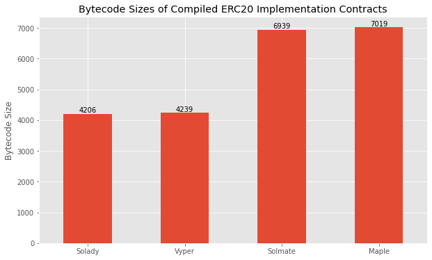
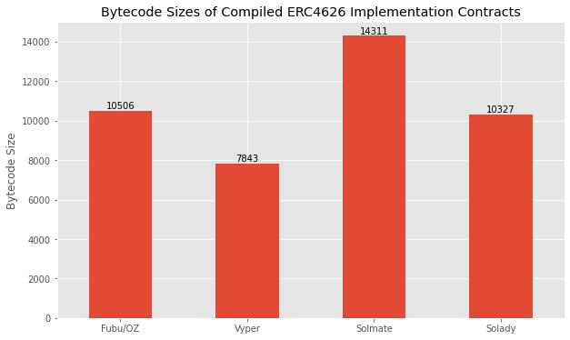
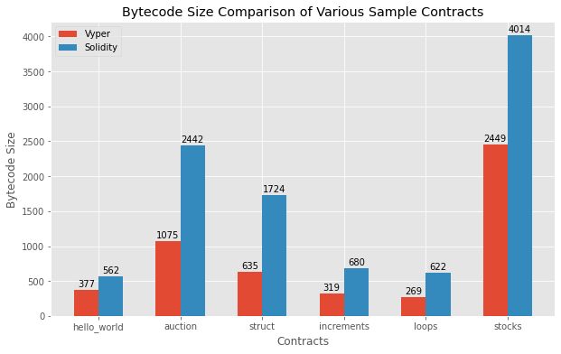

# Vyper / Solidity Bytecode Size Benchmark

We compare the sizes of the binaries produced by <a href="https://github.com/vyperlang/vyper">Vyper</a> and <a href="https://github.com/ethereum/solidity/">Solidity</a> for a sample of different contracts, including different implementations of the ERC20 and ERC4626 standards and basic sample contracts.

Vyper reduces bytecode size by 32 to 63% with an average of 50% on the set of basic sample contracts.

Solidity binaries were compiled using `Solidity 0.8.21+commit.d9974bed.Linux.g++` and the following command:

`solc --optimize --bin --optimize-runs 1 {Contract.sol} > {Contract.bin}`

Vyper binaries were compiled using `Vyper 0.3.9` and the following command:

`vyper {contract.vy} > {contract.bin}`

 

## ERC20 Standard

We compare <a href="https://github.com/de33/ERC20Permit/blob/main/contracts/ERC20Permit.vy">de33's Vyper implementation</a> of the ERC20 standards to different implementations, including the popular <a href="https://github.com/transmissions11/solmate/blob/main/src/tokens/ERC20.sol">solmate implementation</a> and the <a href="https://github.com/Vectorized/solady/blob/main/src/tokens/ERC20.sol">highly optimized solady implementation</a>. We did not use OpenZeppelin's popular implementation as OZ contracts have more fluff which would make the comparison less meaningful.

While solady's implementation is slightly smaller, it is worth noting that the code heavily relies on inline assembly to be more efficient while the Vyper contract was a very standard one. There is no inline assembly in Vyper, but you get the same efficiency with a high level language.

## ERC4626 Standard

We compare <a href="https://github.com/fubuloubu/ERC4626/blob/main/contracts/VyperVault.vy">fubuloubu's Vyper implementation</a> of an ERC4626 vault with their <a href="https://github.com/fubuloubu/ERC4626/blob/main/contracts/SolidityVault.sol">Solidity version</a> of the same code, along with <a href="https://github.com/transmissions11/solmate/blob/main/src/mixins/ERC4626.sol">solmate</a> and <a href="https://github.com/Vectorized/solady/blob/main/src/tokens/ERC4626.sol">solady's</a> implentations.

Vyper offers a 24% reduction over the next smallest compiled binary (solady) and a 34% reduction compared to the average of all Solidity implementations.

## Sample contracts

We generate a set of 6 toy example contracts in both Vyper and Solidity. Some are just very simple examples of basic features, like the `hello_world` contract. Others, like the `auction` and `stocks` contract are a bit more complex. They were taken from the sample contracts included in the vyper repository and translated to Solidity.

Vyper gives a 32% reduction of compiled code size for the simple `hello_world` contract and as much as 63% on the `struct` contract. On average, Vyper reduces the compiled contract size by 50%.

| Contract    | Vyper size | Solidity Size | Reduction |
|-------------|------------|---------------|-----------|
| hello_world | 377        | 562           | 32.9%     |
| auction     | 1075       | 2442          | 56.0%     |
| struct      | 635        | 1724          | 63.2%     |
| increments  | 319        | 680           | 53.1%     |
| loops       | 269        | 622           | 56.7%     |
| stocks      | 2449       | 4014          | 39.0%     |

